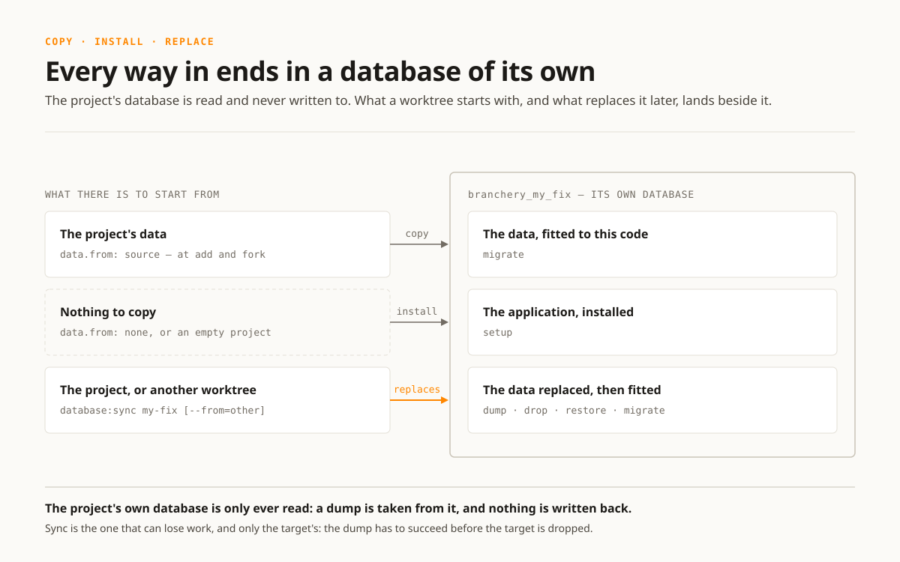

:navigation-title: Databases

..  _databases:

==================
Databases and data
==================

Every worktree has a database of its own on the project's existing database
server. The project checkout and every other worktree remain separate.

..  _databases-received:

What a worktree receives
========================

The project's :ref:`configuration <data-source-and-site-addresses>` decides
whether a new worktree starts with source data or an empty database. The
shipped application profiles copy the project checkout's data by default.

When data is copied, Branchery also brings the unversioned configuration named
under ``data.bring`` and points the files named under ``data.addresses`` at the
new worktree. A site configuration committed to git is never rewritten: that
would make a fresh checkout dirty with an address that must not be pushed.

After a copy, the configuration's ``migrate`` moment fits the schema and
application state to the checked-out code. If the source database is empty, the
``setup`` moment installs the application instead.

    A copy, an installation or a replacement — all three end in the database
    this worktree owns, and none of them writes to the one beside it.

..  _databases-names:

Database names
==============

The databases live beside the project's own:

..  code-block:: text

    db                    the project checkout
    branchery_my_fix      worktree "my-fix"
    branchery_13_4        worktree "13-4"

Names use the ``branchery_`` prefix and replace hyphens with underscores. A long
name is shortened and ends in a digest of the whole name, so distinct worktrees
cannot silently arrive at the same database.

Before a worktree is created, Branchery checks that its database name is free.
An empty database can be taken over. One that contains tables is refused and
left untouched because that data may belong to a worktree removed by hand or to
an interrupted operation; :ref:`an-old-database-blocks-a-name` is the way on.

The database remains available to ordinary DDEV tools:

..  code-block:: bash

    ddev export-db --database=branchery_my_fix
    ddev import-db --database=branchery_my_fix
    ddev mysql

..  _databases-sync:

Replace a worktree's data
=========================

Copy the project checkout's current data into an existing worktree with:

..  code-block:: bash

    ddev branchery database:sync my-fix

Another worktree can be the source:

..  code-block:: bash

    ddev branchery database:sync my-fix --from=other

The dump is taken before the target is dropped, so a dump that fails leaves the
target's data in place. The copy runs through the administrative account DDEV
configured and the native client for MariaDB, MySQL or PostgreSQL; a dump or
restore that fails stops the operation. The code is not changed, and neither
are files outside what ``data.bring`` names — an upload tree such as
``fileadmin`` stays as it is. :ref:`sync <operations-sync>` is the operation,
step by step.

..  warning::

    Synchronization is destructive for the target database. Use an export first
    when its current content may still be needed.

..  _databases-fresh:

Keep the database or start fresh
================================

Provisioning rebuilds dependencies and generated configuration while keeping the
database:

..  code-block:: bash

    ddev branchery worktree:provision my-fix

If the database contains tables, the ``migrate`` moment runs rather than the
application installer. To discard the database and install into an empty one:

..  code-block:: bash

    ddev branchery worktree:provision my-fix --fresh

``--fresh`` removes everything in the worktree database. It does not change the
branch or the project checkout's database.

..  _databases-remove:

Remove data with a worktree
===========================

The normal removal drops the worktree database before removing its checkout and
branch:

..  code-block:: bash

    ddev branchery worktree:remove my-fix

The interface asks for confirmation and does not offer bulk removal for a
worktree with uncommitted changes.

Removing the add-on itself keeps worktrees and databases deliberately. This
makes an uninstall recoverable, but the retained databases need manual cleanup
if they are no longer wanted.

..  _databases-prune:
..  _find-databases-without-a-worktree:

Find databases without a worktree
=================================

List databases carrying the Branchery prefix that no current worktree claims:

..  code-block:: bash

    ddev branchery database:prune

The command only reports them. Remove the listed databases and their data with:

..  code-block:: bash

    ddev branchery database:prune --drop

Only unclaimed databases with the ``branchery_`` prefix are considered. The
project's own ``db`` and unrelated databases on the server are outside the
operation.
